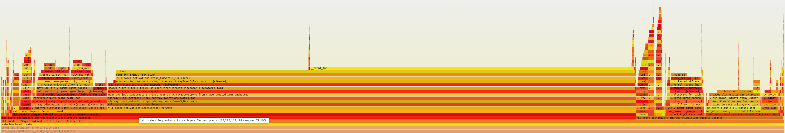
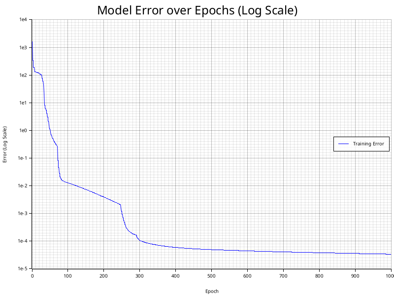
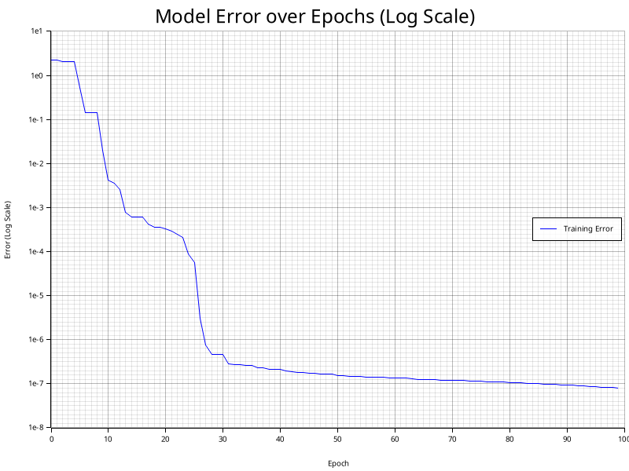

This is the README of [this repository](https://github.com/JakobKrause/RUST_FNN_LMA) 

# Brief abstract

In this project I want to implement a neural network training approach in rust, that can be used for non-linear function fitting. I used to do this in matlab, but fantasized about an application that is easy to run with an efficient backend. So now I want to implement the first step to realize the backend in rust, with ambitions that also implement the front end in rust. 

## -1th Step - Rustlings

Since I am new to rust, I worked through the [rustlings exercises](https://github.com/rust-lang/rustlings) in this [repo](https://github.com/JakobKrause/rustGettingStarted) which provide a great insight into the capabilities of rust.

## 0th Step - Testing first framework

Cloned the [rusty-machine repo](https://github.com/AtheMathmo/rusty-machine)

I chose this repo from [this collection](https://www.arewelearningyet.com/neural-networks/) because i looked for a minimal framework that implements the utility of feedforward neural network training without deep learning approaches. Additionally I don't want to use bindings, rather a pure rust project. This repo seemed to be the most tidied. Unfortunately the Levenberg Marquardt optimizer is not implemented, but maybe i can add it.

In tried to use this framework for fitting a benchmark function, unfortunately it was not able to be used for function fitting, so I abandoned [this repo](https://github.com/JakobKrause/Rust-FNN/) I worked in.

## 1st Step - Testing second framework

I changed to this framework, because i was not happy with the performance of the other first one and since I already look for a sparse implementation (this one is as sparse as it can get), I thought this may be a viable starting point. Unfortunately the Levenberg Marquardt Algorithm is not implemented, but I aim to add it.


Before I will use this framework, I made sure that the main.rs example works as expected. The execution is fast and the prediction is correct. Now I will try to learn a 1D benchmark function, like in the last framework.

### Usage

I have my playground script in ./example/main_1Dbenchmark.rs

Make it known to the cargo environment with this entry in the Cargo.TOML

```
[[bin]]
name = "main_benchmark"
path = "./example/main_1Dbenchmark.rs"
```

The build with 
```console
$ cargo build --release
```
I am using the release flag, because rust is significantly faster with this.

and run
```console
$ ./target/release/main_benchmark
```

## 2nd Step - Restructuring

I am really unhappy with the structure of the framework and will change it.

Done

[commit: Changes to folder structure](https://github.com/JakobKrause/RUST_FNN_LMA/commit/f8a6b1eca1b6377647f539bffcc3780fe18da8f4)

[commit: Function distributions in modules and error handling](https://github.com/JakobKrause/RUST_FNN_LMA/commit/5c7473459d29ef0f930d8722ec62cb5309aa4f15)

I also change the way the model is build with the help of a "SequentialBuilder", this allows for chainable layer addition and a more compact initalization of the model.


## 3rd Step - Plotting and multimodal benchmark

To test this framework I implemented a benchmark function and adjusted the main script, as well as adding a script to plot the results for convenient trouble shooting.


[commit: Benchmark function and plotting](https://github.com/JakobKrause/RUST_FNN_LMA/commit/4aab9a0b349905d90287715626e473424515e27e)

I used the same plotting approach as for the first framework in [this repo](https://github.com/JakobKrause/Rust-FNN/)


Non-linear regression did not work out off the box, so now I will fix it.


## 4th Step - Regularization

Now i have to trouble shoot the with visual debugging, my first suspects would be non normalized data. I fixed this in a quick way in the benchmark function. But a sophisticated normalization approach is still essential, because for training a  NN this is important ([see 3.1. Target Normalization](https://www.baeldung.com/cs/normalizing-inputs-artificial-neural-network#:~:text=3.1.%20Target%20Normalization) ). Then I found out that the weights and biases of the network approach boundaries. So something with the learning rate and gradient calculation is not right. With using the tanh activation function rather than the sigmoid and reducing the learning rate, I was able to fit the data. To still be able to fit with large learning rates I implemented gradient clipping and regularization, both common practices in machine learning.

With these steps, the fitting was acceptable:


[commit: Regularization and gradient clipping](https://github.com/JakobKrause/RUST_FNN_LMA/commit/80e7931d0a233998b7eb885780ce53300ef451c3)


However the used optimization approach too simple, to achieve this kind of fitting I needed to lower the initial learning rate so much that many epochs were needed to approach a good fitting.

So a more sophisticated optimization is required, one solution could be to implement adaptable learning rate. But I do not want to spend for time on the SGD approach. I am a big fan of the [Levenberg Marquardt algorithm](https://www.eng.auburn.edu/~wilambm/pap/2011/K10149_C012.pdf) for function fitting with Neural Networks  because of the adaptive behavior that lies between Gradient Descent- and a Gauss–Newton algorithm. With this we have a stable algorithm that speeds up, in regions that allow it.

## 5th Step - Levenberg Marquardt algorithm


Okay, so with the help of this [source](https://www.eng.auburn.edu/~wilambm/pap/2011/K10149_C012.pdf), the Levenberg Marquardt training was implemented.

This approach was able to fit the dataset within a significant smaller number of epochs. The results I obtain were nearly perfect and the best so far.


[commit: Levenberg Marquardt](https://github.com/JakobKrause/RUST_FNN_LMA/commit/6a121f382d2810135a75b36d0d9d879ece9ecb50)

However the each epoch was taking significantly more time to finish. But in MatLab I was able to get the best and fastest results with the Marquardt approach. So this needs to be further optimized.

For  better debugging i should now implement performance tracking over each epoch, implement train, val and test sets as well as add early stopping which is another form of regularization.

Additionally I need to find the reason for the slow performance of the Levenberg Marquardt algorithm, which could be due to bad starting parameters and slow jacobian calculation. So I need to add a package that let's me analyze the performance of this neural network training.

## 5th Step - Performance optimization

Performance analysis can be easy when you can just use timestamp and do a little "printf-profiling. But here it is not nice because the functions are called on a small time scale and numerous times. 

### Flamegraphs
A good visualization for this is the use of [flamegraphs](https://www.brendangregg.com/flamegraphs.html) which were introduced by Brendan Gregg.

For rust i found the [ [cargo-]flamegraphs](https://github.com/flamegraph-rs/flamegraph) framework, with which i was able to generate this graph:


Unfortunately the used framework does not provide an interactive svg, as it is common for flamegraphs.

But the first take aways from this is, by looking at the main_benchmark::main task, that of course almost all time is spent within the fit function of the neural network. And as expected the calculation of the jacobians is the most expensive task. 

Since the flamegraph is not interactive, well nevermind...  I just need to open the svg in a browser, then it works...


#### Other flamegraph frameworks
Since I looked into other frameworks, here are my findings before figuring out, that I opened the .svg in a wrong way.

For example [here](https://blog.anp.lol/rust/2016/07/24/profiling-rust-perf-flamegraph/) Adam Perry is using perf to generate data that can be used by Brendan Gregg's [flamegraphs](https://www.brendangregg.com/flamegraphs.html). But the use of this is not easy for me and requires practices that I am not familiar with. After some time of trying, I came to the conclusion that this is interesting but right now I need to spent the time for more important matters.

So I was satisfied with another [framework](https://github.com/jlfwong/speedscope) that i found. Here I don't need to use benchmark executeables and perf.

Tracking can be made easy with including guards in the code
```rust
let _scope_guard = flame::start_guard("compute jacobian");
```
And a file is outputted that can be interactively analyzed with this [viewer](https://github.com/jlfwong/speedscope)


### Bottlenecks

So with this flamegraphs it can be seen that the for a small network (681 parameters) and few training data points (1000) (which is on the order of by desired operational area), it can be concluded that the duration of the calculation of the jacobian is primarily governed by the time required to predict the output in order to calculate the derivative with a finite differences approach. Please zoom in. You can find the SVGs in ./flamegraphs/



So to speed up the training, the most obvious thing would be to look for faster implementations of the activation function. The [Crate fastapprox](https://docs.rs/fastapprox/latest/fastapprox/index.html) has this implementation for machine learning purposes.

With the I was able to reduce the time spent in the forward press of the activation function from $73\%$ down to $37\%$ with the faster::tanh implementation. But also the quality of the prediction was significantly reduced, as indicated here:


Only using the faster::tanh implementation for the forward activation function was able to perform better fitting.


But satisfactory results were achieved with the fast::tanh (not faster::tanh) and thus reducing from $73\%$ down to $57\%$.

However the more speed up is achievable with parallelization of the calculation of the jacobians. Since the jacobian has to be calculated for every parameter in the network it makes sense to perform this in parallel.

With changing the iterator for the loop to a parallel iterator with [rayon](https://docs.rs/rayon/latest/rayon/) the most significant speed up is achieved.

With 8 parallel works the speed up was around 3 times due to some parallelization overhead.


The flamegraph now becomes nearly unreadable with the right prominent block manly consisting of parallelization overhead. So if I want to optimize the execution with a flamegraph I won't use parallelization for the visualization.

#### Bottleneck optimization conclusion

With the flamegraphs the bottleneck in terms of CPU performance of this training was identified and reduced. The execution time now does feel like it is comparable with the matlab performance, opening the opportunity to conduct a detailed comparison.

Upon comparing on a first eye glance it can be concluded, that this implementation has problems with achieving small errors rates within a small number of epochs, to visualize it I will implement something similar to this:


### Fitting performance

Now a the framework can display the training error over the epochs.



I can be seen that the shape resembles training in matlab. However here the model is trained for 1000 epochs, in contrast matlab was trained for 100 epochs. This mainly arises from the poor performance in the first ~30 epochs. After the algorithm "locked in" the fitting performance is comparable.

To improve this, I implemented adaptive random distribution for the layer weights, according to the [Xavier Weight Initialization](https://machinelearningmastery.com/weight-initialization-for-deep-learning-neural-networks/). With this the early was a bit more stable, but didn't solve the issue completely. Here the training is run for 100 epochs:


Now it is important to find out, how to improve the training during the early epochs. This procedure is also heavily dependent on the parameters set for Levenberg Marquardt algorithm. Additionally, sometimes I was lucky with the training and a good fit was achieved in a few epochs.



## Next steps

This framework still lacks a validation and test set which is crucial for the machine learning, as well as a dedicated data normalization function.

In addition I need to further analyze the reason for the poor performance during the early epochs.

Also I need to further tidy the framework and try to implement a more general approach to the different 